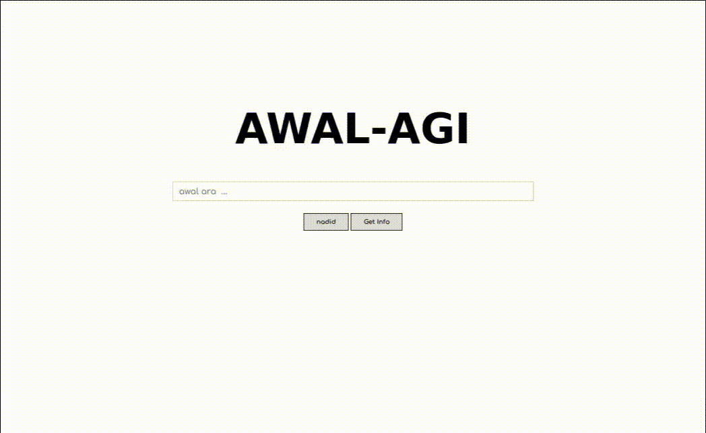

# Project AWAL-AGI 👋
> Ce Projet est open-source .

## Table of Contents
* [Les Info](#general-information)
* [Le Langage Uttiliser](#technologies-used)
* [Comment Sa Marche](#commen-ca-marche)
* [Setup](#setup)
* [Usage](#usage)
<!-- * [License](#license) -->


## General Information
- Une base de donner open source de mot de la lange (kabyle , berber ) Pour des autre project et activiter ...
- enorme base de donner avec des mot
- plus de 25740 mot de la lange kabyle enregister
- nom, verb, adverb, adjectif, ...


## Technologies Used
- PHP 
- ajax, jquery 
- MYSQL (mariadb) 


## Commen Ca Marche
Comment Sa Marche, Cest tout simple au debut on lui donner un text par exemple un live ou un documment bien sur en #kabyle et avec un script en [PHP](https://www.example.com) il trie un peut tout les mot et il les enregistre dans une base de donner, 


## Setup
pour metre ce system en marche vous devrai avoir un server [PHP](https://www.example.com) une [base de doner](https://www.example.com) avec des mot '[vous pouver uttuliser le fichier .sql dans le repertoir si vous vouler pas cree votre propre system ](https://www.example.com)'

quand vous aver tout installer :
- cree un base de donner nomer la "kabyle_word" 
- cree une table comme sa :
``` sql
CREATE TABLE `word` (
  `id` int(11) NOT NULL AUTO_INCREMENT,
  `word` text DEFAULT NULL,
  `type` text DEFAULT NULL,
  `other` text DEFAULT NULL,
  PRIMARY KEY (`id`)
);
```
- aprer il suffi d'ajouter des mots comme sa :
``` sql 
INSERT INTO words(word) VALUES ('azul');
```

voila vous aver votre base de doner avec quelque mot, vous pouver telecharger le fichier [kabyle_words.sql](http://sqdqsd.com) ya plus de 25 000 mot disponible . y au n'aura plus dans le futur .

## Usage

a quoi sa sere d'avoir une base de donner remplie de mot ?

vous pouver fair :
- un dictoiner 
- un clavier qui coriger les errer
- un moteur de recherche
- une IA
- La limite Cest Votre Imagination ;)

## Contact
Created by [@assamer1]() - feel free to contact me!


<!-- Optional -->
<!-- ## License -->
<!-- This project is open source . -->
